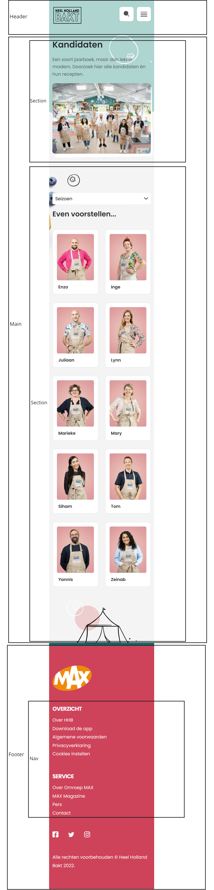

# Procesverslag
Markdown is een simpele manier om HTML te schrijven.  
Markdown cheat cheet: [Hulp bij het schrijven van Markdown](https://github.com/adam-p/markdown-here/wiki/Markdown-Cheatsheet).

Nb. De standaardstructuur en de spartaanse opmaak van de README.md zijn helemaal prima. Het gaat om de inhoud van je procesverslag. Besteedt de tijd voor pracht en praal aan je website.

Nb. Door *open* toe te voegen aan een *details* element kun je deze standaard open zetten. Fijn om dat steeds voor de relevante stuk(ken) te doen.

## Jij

  
uitwerken voor kick-off werkgroep

  ### Auteur:
  Sanne Oosterhof

  #### Je startniveau:
  Blauw

  #### Je focus:
  Responsive (en misschien surface plane)
 

## Je website

  
uitwerken voor kick-off werkgroep

  ### Je opdracht:
  https://www.heelhollandbakt.nl/

  #### Screenshot(s) van de eerste pagina (small screen): 
  Home pagina
  

  #### Screenshot(s) van de tweede pagina (small screen):
  Kandidaten pagina
  
 

## Toegankelijkheidstest 1/2 (week 1)

  
uitwerken na test in 1e werkgroep

  ### Bevindingen
  Sommige tekst werd niet voorgelezen (kan ook aan screenreader liggen)
  Er wordt duidelijk aangegeven met de screenreader waar je bent en wat je kunt doen
  Er is een 'skip to content' bij gebruik van de tab toets
  De tab toets gaat niet langs het menu aan de rechterkant op de kandidaten pagina
  Bij kleurenblindheid zien de meeste afbeeldingen er erg vies uit
  
  #### Screenreader
  Roos heeft met behulp van de screenreader van haar macbook de site van Heel Holland Bakt getest. 
  Tijdens deze test hadden we alle mogelijke opties van de screenreader aangezet, zodat deze echt
  alles voorleest. De belangrijkste uitkomsten van deze test zijn dat het meeste goed wordt 
  voorgelezen, alleen het menu op de kandidaten pagina wordt overgeslagen.  
  
  
  Dit kan opgelost worden door het menu wel voor te laten lezen, of het menu wellicht op
  een andere plek te zetten waardoor het automatisch wordt meegenomen door de 
  screenreader. 

  #### Muis en Toetsenbord 
  Door middel van de tab toets heeft Roos de website getest op toegankelijkheid. Wat gelijk opviel
  was een 'skip to content' link die bovenin het scherm verscheen. Deze werkte ook erg goed bij 
  gebruik en ging gelijk door naar de content. Bij deze test kwam hetzelfde naar voren als bij
  de screenreader test, namelijk dat het menu op de kandidaten pagina wordt overgeslagen.
  Hierdoor werkt de hover van de knopen op die plek ook niet.

  Dit kan opgelost worden door het menu wellicht op een andere plek te zetten waardoor 
  het automatisch wordt meegenomen door de tab toets. 

  #### Motoriek (shocks, elastiekjes)
  De motoriek hebben we kort getest door met een haarklip om 2 vingers de website te gebruiken.
  Dit ging redelijk goed, vooral omdat de tab toets erg goed werkt. Als er iets niet lukte, lag
  dit vooral aan de touchpad van de laptop zelf dan aan het ontwerp van de website. De scrollbar
  aan de zijkant werkte ook erg goed. 

  Er is niks wat opgelost hoeft te worden, aangezien alles prima werkt.

  #### Visueel (brillen, contrast, kleurenblind, dark/light). 
  Met behulp van de wazige bril, de bril met 2 kleine kijkgaatjes en de inspector van google chrome
  hebben we de website getest. Tijdens de test met de wazige bril ging Roos vooral heel dicht
  naar het scherm toe, om iets te kunnen lezen. Een aantal dingen waren totaal niet te lezen: 
  de knoppen, kleine tekst onder de koppen en de navigatiebalk. Bij de bril met 2 kleine gaatjes 
  keek Roos vooral met 1 oog naar de webiste, waardoor alles prima te zien was. Ik heb de
  kleurenblindheid protanopia, deuteranopia, tritanopia en achromatopsia getest op de website. 
  Hieruit bleek vooral dat de afbeeldingen een erg vieze kleur kregen, maar de tekst overal
  goed te lezen was met een goed contrast.

  Dit kan opgelost worden door de afbeeldingen een minder felle kleur te geven, zodat mensen
  met kleurenblindheid het minder heftig zien en het minder vies wordt. 

## Breakdownschets (week 1)

  
uitwerken na afloop 2e werkgroep

  ### de hele pagina: 
  
  

  ### dynamisch deel (de laatste artikelen): 
  

  ### nog een dynamisch deel (kandidaten): 
  

## Voortgang 1 (week 2)

  
uitwerken voor 1e voortgang

  ### Stand van zaken
  Ik denk dat de HTML maken op basis van mijn breakdownschetsen best goed ging. Alhoewel ik niet helemaal zeker ben of alles
  klopt. Wat ik lastig vind is de CSS en om dit werkend te krijgen zonder id's en classes. 
  

  ### Agenda voor meeting
  samen met je groepje opstellen

  Kyra: 
  - Witregels van tekst aanpassen
  - Buttons op de manier van de website plaatsen

  Lotte:
  - Afbeeldingen als tegels
  - Afstand van de tekst
  - Of de HTML helemaal klopt   

  Sanne:
  - Of de HTML helemaal klopt   
  - Header in het wit ipv roze?  
  - Linkjes apart stylen?
  - Moet de achtergrond hetzelfde? 

  Jelle:  
  - Hoe insta feed toevoegen aan homepagina of dit oplossen 
  - Welke heading aan de footer geven?
  

  <!-- | Kyra           | Lotte                    | Sanne                               | Jelle?           |
  | ---            | Afbeeldingen als tegels  | Klopt mijn HTML helemaal            | ---              |
  | dit bespreken  | Afstand van de tekst     | Header in het wit ipv roze?         | en dan ik dat    |
  | en dat ook nog | ...                      | Linkjes apart stylen met een class? | dit wil ik zeker |
  | ...            | ...                      | Moet de achtergrond hetzelfde?      | ...              | -->
   

  ### Verslag van meeting
  hier na afloop snel de uitkomsten van de meeting vastleggen

  - Voor nu kan ik de header wit houden, misschien als ik tijd over heb ook roze maken.
  - Mijn HTML is zo goed als semantisch
  - Als ik uitdaging wil de H3 voor de img laten staan, vervolgens met CSS omdraaien.  
  - De 2 HTML pagina's mogen een class, om ze zo verschillend van elkaar te kunnen stylen.
  - De buttons moet ik specifieker stylen, zodat ze niet allemaal tegelijk gaan. 
  - Achtergrond met de roze golf voor nu achterwege laten, misschien als ik tijd over heb.

## Voortgang 2 (week 3)

  
uitwerken voor 2e voortgang

  ### Stand van zaken
  hier dit ging goed & dit was lastig (neem ook screenshots op van delen van je website en code)

  ### Agenda voor meeting
  samen met je groepje opstellen

  Kyra: 
  - ..
  - ..

  Lotte:
  - ..
  - ..

  Sanne:
  - Of de CSS goed op volgorde staat 
  - In hoeverre alles overeen moet komen met de echte website (witruimte, font,..)
  - Kan ik zo een menu maken als in de header? Of mag ik die overslaan

  Jelle:  
  - ..
  - ..

  <!-- | student 1      | student 2          | student 3    | student 4        |
  | ---            | ---                | ---          | ---              |
  | dit bespreken  | en dit             | en ik dit    | en dan ik dat    |
  | en dat ook nog | dit als er tijd is | nog een punt | dit wil ik zeker |
  | ...            | ...                | ...          | ...              | -->

  ### Verslag van meeting
  hier na afloop snel de uitkomsten van de meeting vastleggen

- Mijn code is semantisch en CSS op een logische volgorde.
- De echte website hoeft niet 1 op 1 overeen te komen, lastige stukken eventueel bewaren om te doen met tijd over.
- Het menu in de header voor nu niet op focussen, want navigatie werkt. Maar met tijd over kan dit wel. 

## Toegankelijkheidstest 2/2 (week 4)

  
uitwerken na test in 8e werkgroep

  ### Bevindingen
  Lijst met je bevindingen die in de test naar voren kwamen (geef ook aan wat er verbeterd is):

  #### Screenreader
 
  Werkt goed, alle links/knoppen worden voorgelzen. De afbeeldingen hebben ook een duidelijke alt tekst, wat uitleg geeft. 

  #### Muis en Toetsenbord 

  Kan met de tab toets door alle links/knoppen kan op enter drukken om naar een andere pagina te navigeren. Dit werkt dus goed, misschien nog wat meer aangepaste styling ervoor maken. 

  #### Motoriek (shocks, elastiekjes)

  Met elastiekjes op de vingers is het geen probleem om door de site te navigeren. Dit gaat dus helemaal goed en hoeft verder niks aan te veranderen. 

  #### Visueel (brillen, contrast, kleurenblind, dark/light). 
  Met de wazige bril zijn de koppen wel leesbaar maar de tekst eronder is niet leesbaar. De tekst op de roze achtergrond en witte tekst valt weg in de achtergrondskleur.
  Met de kleurenblindbril is alles gewoon goed zichtbaar het contrast is nog steeds duidelijk, hierdoor is alles leesbaar. De kleuren veranderen wel maar heeft dus geen invloed dat de gebruiker informatie niet kan zien/lezen.

## Voortgang 3 (week 4)

  
uitwerken voor 3e voortgang

  ### Stand van zaken
  Wat goed ging was het verder werken aan de CSS. Ik vond het erg lastig wanneer ik ergens mee bezig was en het niet werkte, waardoor ik soms best wel gefrustreerd werd. 

  ### Agenda voor meeting
  samen met je groepje opstellen

   Kyra: 
  - ...
  - ...

  Lotte:
  - ...
  - ...

  Sanne:
  - Hoe kan ik de navigatie het beste namaken, zodat het er enigzins op het origineel lijkt. 
  - Kan ik het dropdown menu stylen zodat het erop lijkt. 
  - In hoeverre moet het helemaal responsive zijn?

  Jelle:  
  - ...
  - ...

  <!-- | student 1      | student 2          | student 3    | student 4        |
  | ---            | ---                | ---          | ---              |
  | dit bespreken  | en dit             | en ik dit    | en dan ik dat    |
  | en dat ook nog | dit als er tijd is | nog een punt | dit wil ik zeker |
  | ...            | ...                | ...          | ...              | -->

  ### Verslag van meeting
  hier na afloop snel de uitkomsten van de meeting vastleggen

  - Nog steeds goed op weg
  - Navigatie moet wel lukken om na te maken, al deels tijdens de les kunnen doen
  - Meer focussen op grote dingen van de website, vergeleken met kleine details. Dat als laatste doen. 

## Eindgesprek (week 5)

  
uitwerken voor eindgesprek

  ### Je uitkomst - karakteristiek screenshots:
  
  

  ### Dit ging goed/Heb ik geleerd: 
  Ik heb vanzelfsprekend tijdens dit vak erg veel geleerd, onder andere dat ik ook niet te lang door moet gaan met te kleine dingen. Wat ik het leukste vond en ook helemaal nieuw was voor mij, 
  was de media query. Ik vond het erg leuk om de site responsive te maken, terwijl ik in eerste instantie voor surface plane had gekozen. Uiteindelijk is het me gelukt om de site volledig responsive te maken en 
  daarnaast ook een aantal onderwerpen uit de surface plane toe te passen. Hieronder is bijvoorbeeld te zien hoe ik een klein deel responsive heb gemaakt, wat ik erg leuk vond om te doen. 

  
  

  ### Dit was lastig/Is niet gelukt:
  Het is niet gelukt om de roze/groene achtergrond te maken met de golvende afbeelding. Dit wilde ik doen als ik tijd over had, wat helaas niet gelukt is. Daarnaast heb ik mijn navigatiebalk standaard
  wit gemaakt, ipv bij het scrollen pas wit. Tot slot heb ik geprobeerd de witte balk bovenin het scherm na te maken, maar hier had ik niet genoeg tijd meer voor. Het staat nog wel in mijn HTML, om te laten
  zien dat ik het heb geprobeerd. 

  

## Bronnenlijst

  
continu bijhouden terwijl je werkt

  Nb. Wees specifiek ('css-tricks' als bron is bijv. niet specifiek genoeg).

  1. Heel Holland Bakt (https://www.heelhollandbakt.nl/)
  2. Voor het menu (https://codepen.io/shooft/pen/jOzvRvm)
  3. Voor de mooie button animaties (https://codepen.io/robertspier/pen/zYaeMKP?editors=1100)
  4. Voor header schaduw (https://www.cssmatic.com/box-shadow)
  5. Select tag toepassen (https://www.w3schools.com/tags/tag_select.asp)
  6. Voor de link/button states (https://codepen.io/shooft/pen/yLKWzqy)

